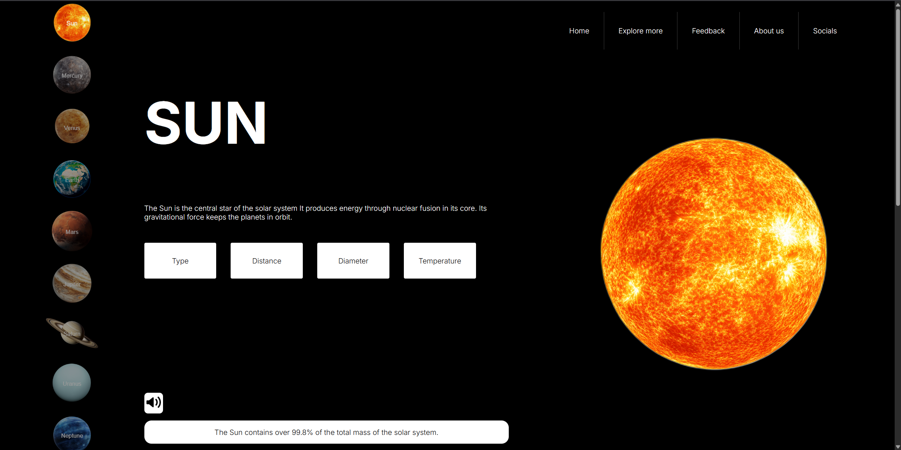
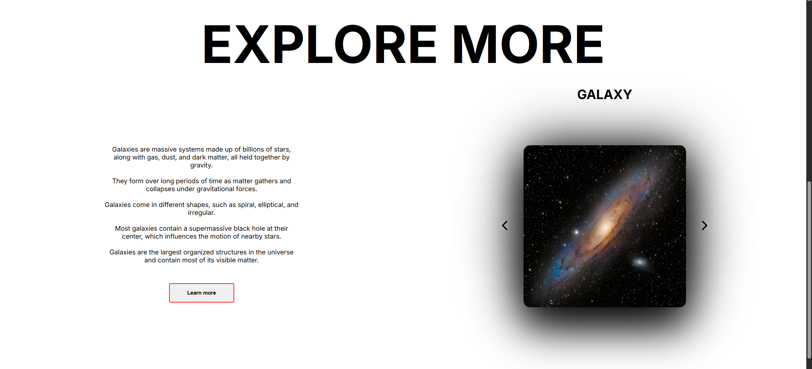
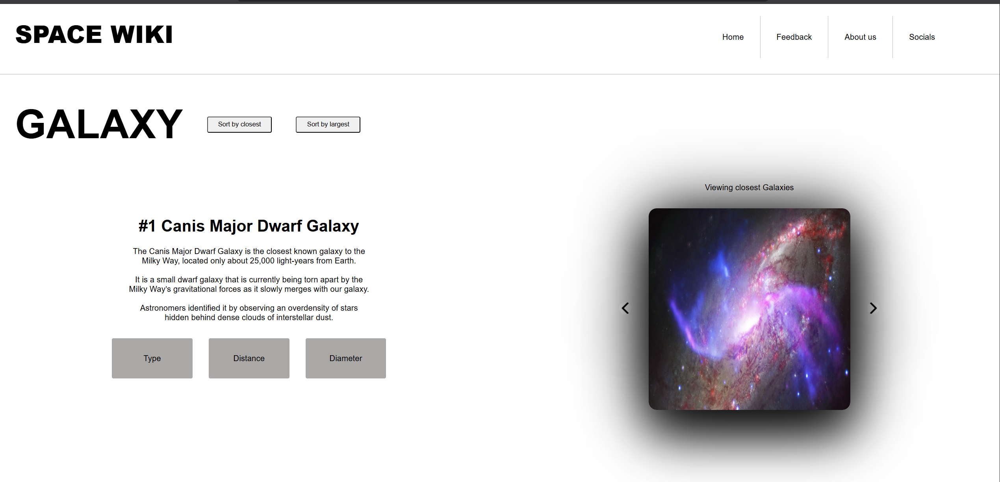

# Space Wiki

A basic **static astronomy wiki** built as a university front-end project.

## Screenshots

## Tech Stack ▪️
- HTML
- CSS
- JavaScript

## Features ▫️
- Interactive solar system view  
- Planet info with images and facts  
- Different topics to discover
- Closest / largest sorting modes  

## Run Locally ⚙️
1. Clone the repo  
2. Run a live server
3. Open `index.html` in a browser  
