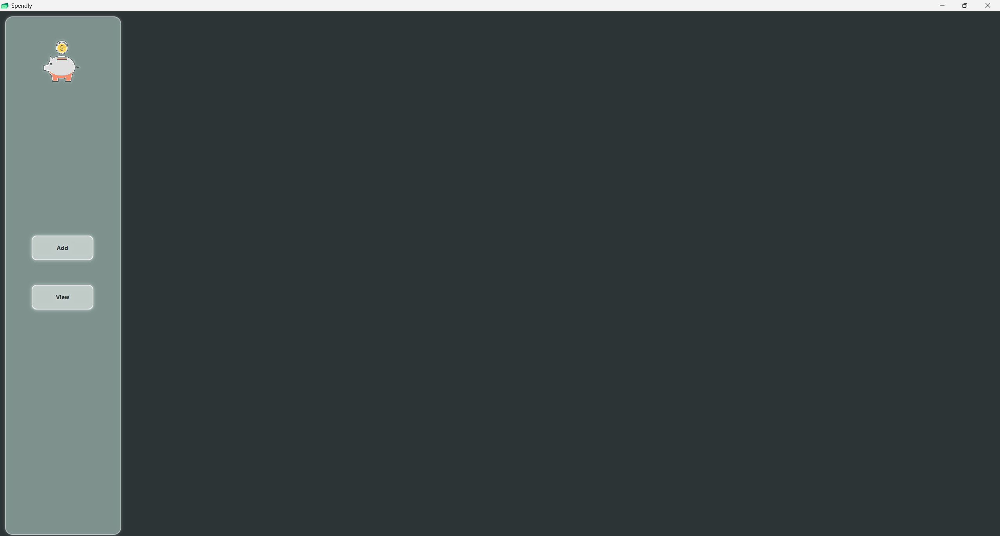
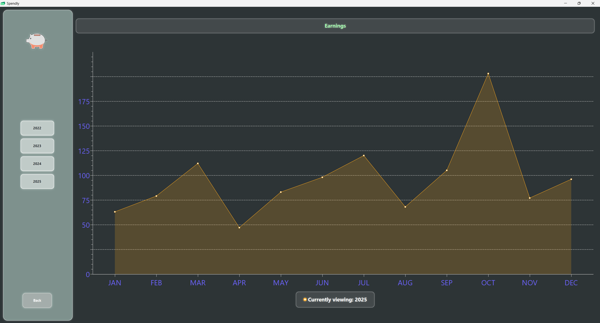

# Spendly - Finance Tracker

**Description:**
A lightweight **JavaFX application** for tracking personal finances.  
Visualizes earnings and spendings with charts.

## Tech Stack:
- Java (JDK 24)
- JavaFX
- IntelliJ IDEA

## Screenshots

**Screenshot 1**  

**Screenshot 2**  

## Features
- Track daily, monthly, and yearly spendings/earnings  
- Simple and responsive UI  
- Data saved locally  
- Visual summaries via `AreaChart`

## ⚙️ How to Run
1. Clone the repo
2. Run `Main.java`
3. Optional: load sample data from `sample_data/`
